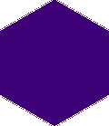

<!-- README.md is generated from README.Rmd. Please edit that file -->
txomics 
========================================================

Overview
--------

Functional analysis of transcriptomic data

Installation
------------

You can install the released version of txomics from [CRAN](https://CRAN.R-project.org) with:

``` r
install.packages("txomics")
```

And the development version from [GitHub](https://github.com/) with:

``` r
# install.packages("devtools")
devtools::install_github("luciorq/txomics")
```

Example
-------

This is a basic example which shows you how to solve a common problem:

``` r
## basic example code
```

------------------------------------------------------------------------

Please note that this project is released with a [Contributor Code of Conduct](CODE_OF_CONDUCT.md). By participating in this project you agree to abide by its terms.
